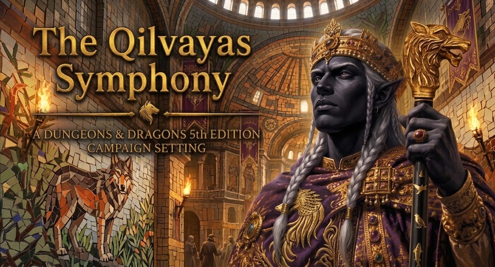

<p align="center">
  
</p>

# The Qilvayas Symphony

An imperial fantasy campaign set in the declining Empire of Zhuvedus, where a young
drow emperor attempts to restore former glory through legal reform, institutional
rebuilding, and diplomatic reunification. The player characters are final-year
students at the Imperial Academy of the Lupine Throne, drawn out of their intended
futures by a shared prophetic vision of the capital burning.

This repository is the source of truth for the campaign.

## How this repository works

The **generator scripts are the canon.** Everything else is input to them or output
from them — with one exception, `images/`, noted below. To change the campaign, edit a
script in `scripts/` and run `tools/build.sh`; never edit the generated files directly,
because the next build discards those edits.

| Directory | What it is |
|---|---|
| `scripts/` | **The canon.** docx-js generators, `transplant.py`, and the encoded visual template. |
| `corpus/` | **Generated Markdown** — readable and greppable on any device. Start here. |
| `documents/` | **Generated PDF** — styled, embeds its fonts, reads on any device. |
| `tools/` | `build.sh` regenerates and verifies everything; `docx-md-shim/` emits the Markdown; `normalize_pdf.py` makes the PDF reproducible. |
| `reference/` | The mirrored instructions for the Claude Chat project. |
| `drafts/` | Design drafts awaiting sign-off. **Not canon.** |
| `images/` | Artwork, named for what it depicts. Serves the repository today and the documents eventually. **Outside the build** — see below. |

`corpus/` and `documents/` are produced from the same untouched scripts in the same
build, so the Markdown and the published documents cannot drift apart.

`images/` is the one directory the build does not touch. The generators emit `.docx`
through docx-js and the Markdown shim has no image path, so getting artwork into the
published documents means extending both sides of the pipeline rather than dropping a
file in a folder — a deliberate later pass, deferred until there is enough art to
justify it. For now these files serve the repository itself, starting with the banner
at the top of this page.

## The documents

### Sourcebook

- [The Qilvayas Symphony Campaign Setting](corpus/The_Qilvayas_Symphony_Campaign_Setting.md) — the canonical sourcebook · [PDF](documents/The_Qilvayas_Symphony_Campaign_Setting.pdf)

### Session modules

| Session | Title | Markdown | Document |
|---|---|---|---|
| 0 | Foundations | [md](corpus/QS_Session_0_Primer.md) | [PDF](documents/QS_Session_0_Primer.pdf) |
| 1 | The Silent Road | [md](corpus/QS_Session_1_The_Silent_Road.md) | [PDF](documents/QS_Session_1_The_Silent_Road.pdf) |
| 2 | The Road Back | [md](corpus/QS_Session_2_The_Road_Back.md) | [PDF](documents/QS_Session_2_The_Road_Back.pdf) |
| 3–4 | The Proving Below | [md](corpus/QS_Sessions_3-4_The_Proving_Below.md) | [PDF](documents/QS_Sessions_3-4_The_Proving_Below.pdf) |
| 5 | Dead Letters | [md](corpus/QS_Session_5_Dead_Letters.md) | [PDF](documents/QS_Session_5_Dead_Letters.pdf) |
| 6 | The Second Seal | [md](corpus/QS_Session_6_The_Second_Seal.md) | [PDF](documents/QS_Session_6_The_Second_Seal.pdf) |
| 7 | The Turning Away | [md](corpus/QS_Session_7_The_Turning_Away.md) | [PDF](documents/QS_Session_7_The_Turning_Away.pdf) |
| 8 | The Unkept Vigil | [md](corpus/QS_Session_8_The_Unkept_Vigil.md) | [PDF](documents/QS_Session_8_The_Unkept_Vigil.pdf) |

### Guides

- [DM Reference Guide](corpus/QS_DM_Reference_Guide.md) — quick-lookup tables, the Branch Ledger, the deliberately-open list · [PDF](documents/QS_DM_Reference_Guide.pdf)
- [Player Guide](corpus/QS_Player_Guide.md) — the sanitized, shareable edition · [PDF](documents/QS_Player_Guide.pdf)

## Rebuilding

```bash
npm install docx                                    # generator dependency
apt-get install -y libreoffice-writer ghostscript poppler-utils
tools/build.sh
```

`build.sh` regenerates both outputs, applies the visual template, renders every
document to a reproducible PDF, and **fails the build** on escape-sequence leaks or font
substitution. It refuses to run at all if the template's three fonts — Alegreya SC,
Alegreya Sans SC, and Lato — are not installed, because layout verified under substituted
fonts is not the layout that gets published.

The PDFs are byte-reproducible: an unchanged document rebuilds to an identical file, so a
rebuild only ever touches the documents whose content actually changed.

See [`PIPELINE_README.md`](PIPELINE_README.md) for the full pipeline reference and
[`CLAUDE.md`](CLAUDE.md) for the working instructions and canon rules.
